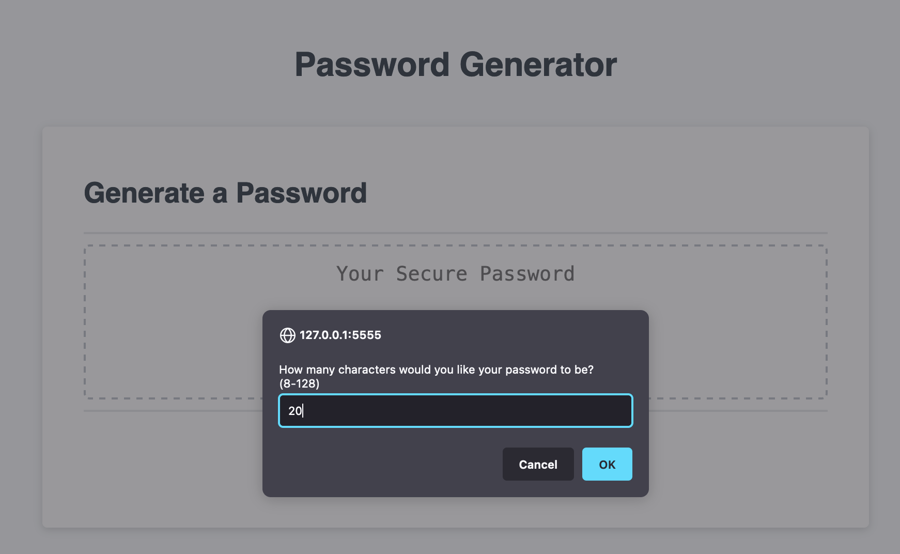

# Password Generator


A simple password random password generator web application. 

## Table of Contents

- [Introduction](#introduction)
- [Features](#features)
- [Installation](#installation)
- [Technologies](#technologies)
- [License](#license)

## Introduction

The Password Generator is a web application made to help users create random passwords based on selected prompts. With this web application, users can easily generate strong secure passwords.

## Features

- Generate random passwords with user-specified length (between 8 and 128 characters)
- Choose from character types: lowercase letters, uppercase letters, numbers, and special characters
- Responsive design UI both Desktop/Mobile

## Installation

1. Clone this repository:

```bash
git clone https://github.com/your-username/password-generator.git

```
2. Navigate to the project directory:


3. Open the index.html file in your browser.


4. Have Fun!

## Technologies

- HTML
- CSS
- JavaScript

## License

[MIT](https://choosealicense.com/licenses/mit/)